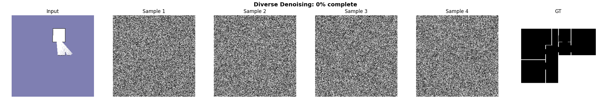
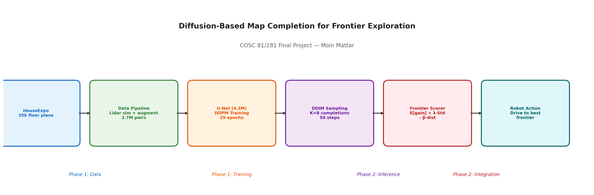
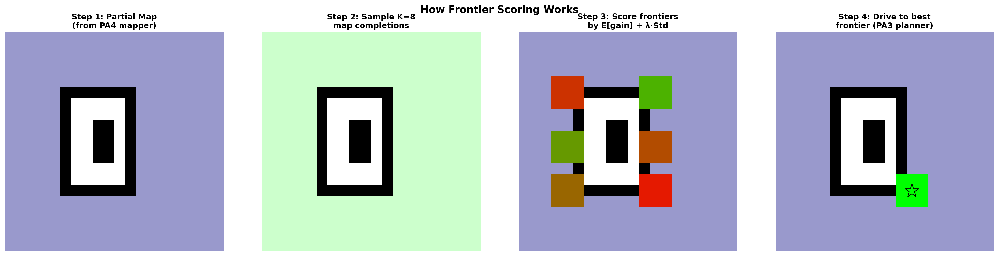
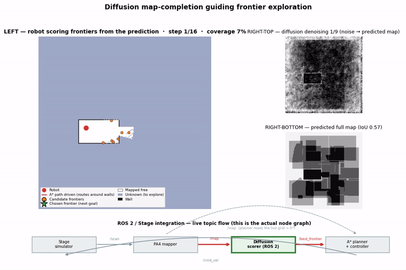
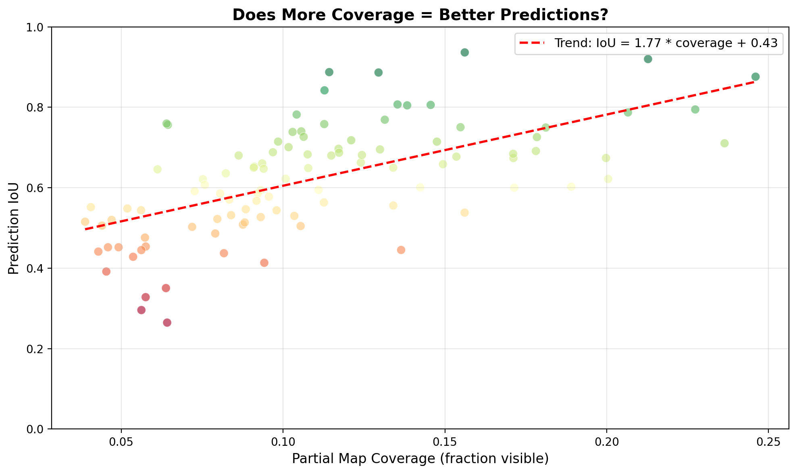
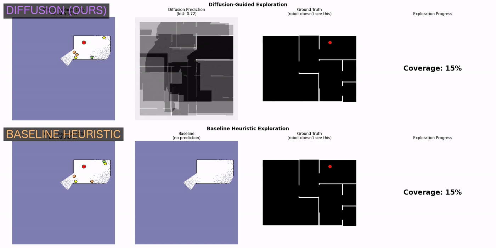
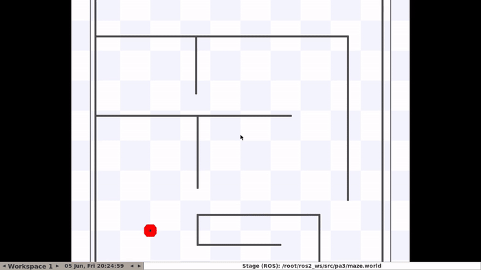

# 🧭 Diffusion-Based Map Completion for Frontier Exploration

> **Teaching a robot to _imagine_ the part of a building it hasn't seen yet — and explore smarter because of it.**

**COSC 81/281 Final Project** · Dartmouth College · Spring 2026 · _Moin Mattar (solo)_

<p align="center">
  <a href="https://youtu.be/0HEBEHLy_AY">
    
  </a>
  <br><em>▶︎ Click to watch the full project presentation</em>
</p>

---

## 💡 The idea: a world model for robots

Most robots explore **blindly** — they react only to what their sensors have already seen. People don't. Walk into a house, spot a dog toy on the floor, and you already guess there's a dog, and probably a food bowl nearby. That's a **world model**: an understanding of how physical spaces are usually laid out.

This project gives a robot a small version of that intuition. A **conditional diffusion model** looks at a partial occupancy map and _imagines_ the full floor plan — and those imagined completions decide where to explore next.

<p align="center"></p>

---

## ⚙️ How it works

```
partial map  ──►  diffusion completes it   ──►  score the frontiers   ──►  A* plans & drives
  (lidar)          (8 sampled completions)       (expected info gain)        (to the best one)
```

<p align="center"></p>

- **Data:** [HouseExpo](https://github.com/TeaganLi/HouseExpo) — 35,126 floor plans → **2.66M** partial/complete pairs via simulated lidar + rotation/flip augmentation.
- **Model:** a **4.16M-parameter** conditional U-Net. Trained with the **DDPM** denoising objective; sampled at inference with **DDIM** (50 steps).
- **Scoring:** sample **K = 8** completions per map and score each frontier by _expected information gain_ **+** _uncertainty across samples_ **−** _distance_. Where the 8 guesses disagree is exactly where it's worth looking.

<p align="center"></p>

---

## 🤖 Watch it explore

The robot completes the map, scores frontiers, and drives — the bottom strip is the **live ROS 2 node graph** lighting up as each module fires.

<p align="center"></p>

---

## 📊 Results (honestly)

- **0.62 IoU** completing single-scan maps on a held-out test set, sharpening toward **~0.88** as the robot accumulates scans.
- In our Stage ablation, the diffusion scorer chose frontiers with **+24.5% information gain** over the strongest geometric baseline (winning or tying all 10 trials).
- **Honest limitation:** on a small, simple maze the classic geometric methods are often just as good. The diffusion prior's advantage grows with environment **ambiguity**, not size — this is a first real step toward world models for robotics, not a finished product.

<p align="center">
  
  &nbsp;&nbsp;
  
</p>

---

## 🔌 Real ROS 2 / Stage integration

It runs as a **closed-loop ROS 2 system**, not a one-shot pipeline. The A* planner replans on the **live** map every update, so the mapper, scorer, and planner continuously influence one another:

```
Stage ─/base_scan→ PA4 mapper ─/map→ diffusion scorer ─/best_frontier→ A* manager ─/cmd_vel→ Stage
```

<p align="center"></p>

```bash
# from ros2_ws/src/diffusion_explorer/   (needs stage_ros2 + PyTorch installed)
bash launch_exploration.sh              # diffusion-guided exploration
bash launch_exploration.sh --baseline   # geometric baseline
```

---

## 📂 What's in here

| Path | |
|------|--|
| `src/` | the model (`unet.py`, `diffusion.py`), training, evaluation |
| `ros2_ws/src/diffusion_explorer/` | the 3 ROS 2 nodes + launch (diffusion scorer, baseline scorer, A* manager) |
| `ros2_ws/src/pa4`, `ros2_ws/src/pa3` | the occupancy mapper + maze world the system integrates with |
| `scripts/` | training + the 4-condition ablation harness |
| `results/` | trained checkpoint, metrics, figures, demo clips |
| `docs/report.pdf` | the full IEEE research paper |
| `results/project_journey.html` | the visual project journal |

## 🔗 Links

- 🎥 **Presentation video:** https://youtu.be/0HEBEHLy_AY
- 📄 **Report (IEEE paper):** [`docs/report.pdf`](docs/report.pdf)
- 📓 **Project journal:** [`results/project_journey.html`](results/project_journey.html)

---

<sub>Solo project — all code, figures, and writing are the author's own. Generative AI (Anthropic Claude) was used for LaTeX/Markdown formatting, code review, and as a study partner for diffusion-model concepts. Signature: <em>Moin Mattar</em>.</sub>
